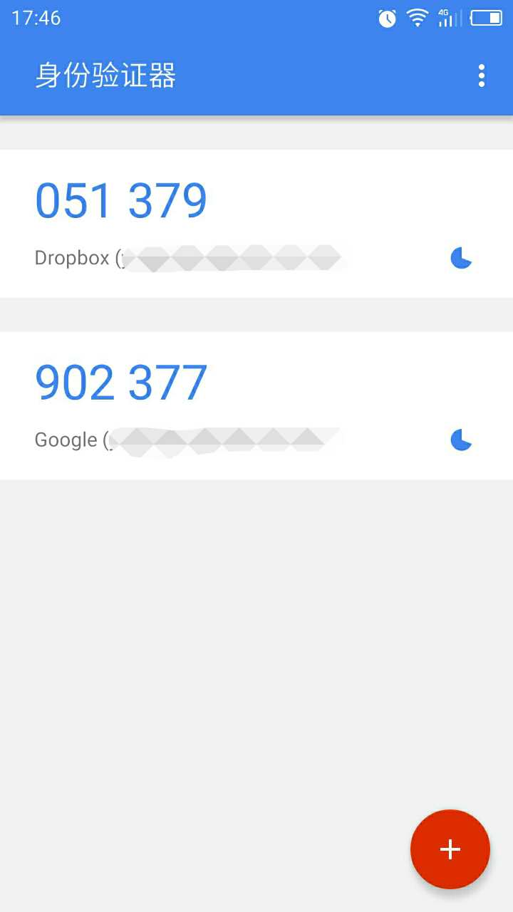

### 双重认证
双重认证（英语：Two-factor authentication，缩写为2FA），是一种认证方法，使用两种不同的元素，合并在一起，来确认使用者的身份，是多因素验证中的一个特例。目前流行的主要是基于智能手机的两步验证，其中主流的又分 APP 方式和短信方式。

### Google Authenticator
Google Authenticator 是一种 APP 方式的两步验证。谷歌验证应用的使用方法是：用户安装手机客户端，生成临时身份验证码，提交到服务器验证身份。

#### Google 两步验证的原理
服务器首先要给每个用户生成一个 KEY，然后按照 `HOTP`（HMAC-based One-time Password） 或者 `TOTP`（Time-Based One-Time Password） 协议生成 `CODE`，根据协议不同，生成的 `CODE` 分别是`基于计数`的或者`基于时间`的。


#### TOTP

1. 共享密钥
    服务器端生成一个32位的密钥，共享给客户端。

2. 客户端生成随机令牌
    客户端根据当前时间片和共享密钥生成一个随机令牌。
    > 这里比较重要的是用户手机时间要准确

3. 服务器验签
    服务器端根据当前时间和共享密钥生成一个随机令牌，两者比对。
    > 服务器使用和客户端同样的共享密钥和时间片得到的随机令牌，两者是一样的。  

    伪代码
    ```
    hmac = SHA1(secret + SHA1(secret + input))
    ```

服务器时间和客户端时间可能不一致，这样就会导致服务器计算的令牌与用户输入的不同，验证失败。解决这个问题个一个方法是，服务器计算当前时间片以及前面的 n 个时间片内的一次性密码值，只要其中有一个与用户输入的密码相同，则验证通过。当然，n 不能太大，否则会降低安全性。

#### HOTP

1. 共享密钥和计数器    
    服务器端生成一个32位密钥，另外客户端和服务器各有一个计数器C，并且事先将计数值同步。

2. 客户端生成随机令牌    
    客户端根据共享密钥和计数器的组合生成一个生成一个随机令牌，生成后客户端计数器计数值加1。

3. 服务器验签    
    服务器同样根据共享密钥和计数器生成一个随机令牌，两者比对。如果相同，服务器计数器加1。

> 如果验证失败或者客户端不小心多进行了一次生成密码操作，那么服务器和客户端之间的计数器C将不再同步，因此需要有一个重新同步（Resynchronization）的机制。

`HOTP` 算法中的计数器类似于 `TOTP` 中的时间片。`TOTP` 接收完共享密钥后就不需要和服务器进行交互了，`HOTP` 后面还需要和服务器同步计数器。这样看来 `TOTP`的方式可用性更高（特别是在国内不能访问Google服务的情况下），实现也更加简单。另外，为了安全两者本地的功效密钥都不能被第三方获知。

### 参考
[【1】](https://www.zhihu.com/question/20462696) [【2】](http://www.infoq.com/cn/news/2014/09/system-verification) [【3】](http://blog.zlxstar.me/blog/2015/09/02/qian-tan-liang-bu-yan-zheng/) [【4】](https://linux.cn/article-2641-1.html)
