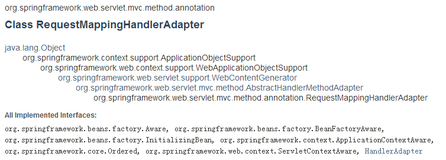

RequestMappingHandlerAdapter
===========

HandlerAdapter
--------
在`DispatcherServlet`中遍历所有的HandlerAdapter，返回第一个`supports`为`true`的HandlerAdapter。

	boolean supports(Object handler); 
	ModelAndView handle(HttpServletRequest request, HttpServletResponse response, Object handler) throws Exception;
	long getLastModified(HttpServletRequest request, Object handler);

RequestMappingHandlerAdapter
--------
类图关系图

**supports(...)**  
在其父类`AbstractHandlerMethodAdapter`中定义

	@Override
	public final boolean supports(Object handler) {
		// 此handler必须是HandlerMethod对象的实例。默认RequestMappingHandlerMapping.getHandler()获得的HandlerExecutionChain.handler即为HandlerMethod对象。
		return handler instanceof HandlerMethod && supportsInternal((HandlerMethod) handler);
	}

**handle(...)**
`AbstractHandlerMethodAdapter`类中通过调用`handleInternal`实现。`handleInternal`是一个抽象方法。

	@Override
	public final ModelAndView handle(HttpServletRequest request, HttpServletResponse response, Object handler)
			throws Exception {
		//  handleInternal 抽象方法
		return handleInternal(request, response, (HandlerMethod) handler);
	}

**handleInternal(...)**  

	@Override
	protected final ModelAndView handleInternal(HttpServletRequest request,
			HttpServletResponse response, HandlerMethod handlerMethod) throws Exception {

		if (getSessionAttributesHandler(handlerMethod).hasSessionAttributes()) {
			// Always prevent caching in case of session attribute management.
			checkAndPrepare(request, response, this.cacheSecondsForSessionAttributeHandlers, true);
		}
		else {
			// Uses configured default cacheSeconds setting.
			checkAndPrepare(request, response, true);
		}

		// Execute invokeHandlerMethod in synchronized block if required.
		if (this.synchronizeOnSession) {
			HttpSession session = request.getSession(false);
			if (session != null) {
				Object mutex = WebUtils.getSessionMutex(session);
				synchronized (mutex) {
					return invokeHandleMethod(request, response, handlerMethod);
				}
			}
		}
		// 主要调用实际Controller中的方法（HandlerMethod对象对应的真正的Method），封装数据获取一个ModalAndView对象。
		return invokeHandleMethod(request, response, handlerMethod);
	}

