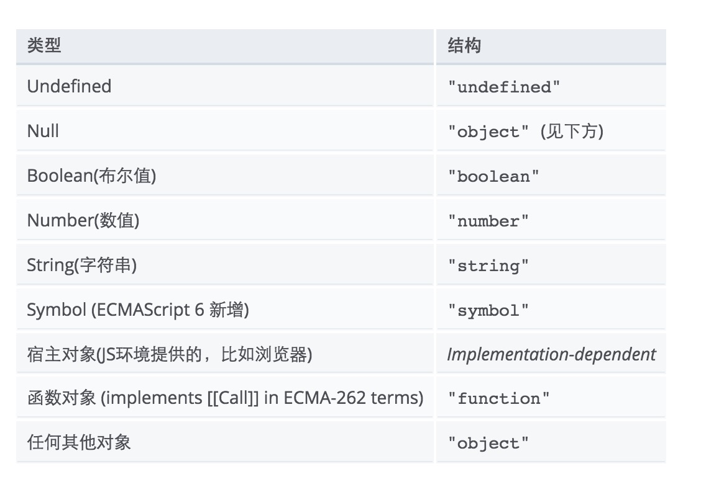

`typeof`和`instanceof`是JavaScript中的两个操作符。

### typeof
typeof操作符返回一个字符串,表示未经求值的操作数(unevaluated operand)的类型。
下面的表格总结了 typeof 可能的返回值。


注意事项：
```
typeof null === 'object'; // true

typeof NaN === 'number'; // true

typeof new Date() === 'object'; // true
typeof new Boolean(true) === 'object'; // true
typeof new Number(1) ==== 'object'; // true
typeof new String("abc") === 'object'; // true
```

### instanceof
instanceof运算符可以用来判断某个构造函数的prototype属性所指向的對象是否存在于另外一个要检测对象的原型链上。

instanceof运算符希望左操作数是一个对象，右操作数标识对象的类。如果左侧的对象是右侧类的实例，则表达式返回true；否则返回false。

为了计算表达式o instanceof f，JavaScript首先计算f.prototype，然后在原型链中查找o，如果找到，那么o是f（或者f的父类）的一个实例，表达式返回true。如果f.prototype不在o的原型链中的话，那么o就不是f的实例，instanceof返回false。

原型链


JavaScript中有个原型链的概念，这个`链`一般是通过对象的`__proto__`属性来建立的。`prototype`代表原型，`prototype`对象都有一个`constructor`属性，指向它的构造函数。这里的instanceof就是去判断是否在一条原型链上。

### 参考
[【1】](https://developer.mozilla.org/zh-CN/docs/Web/JavaScript/Reference/Operators/typeof) [【2】](https://developer.mozilla.org/zh-CN/docs/Web/JavaScript/Reference/Operators/instanceof) [【3】](http://www.nowamagic.net/librarys/veda/detail/1642)
