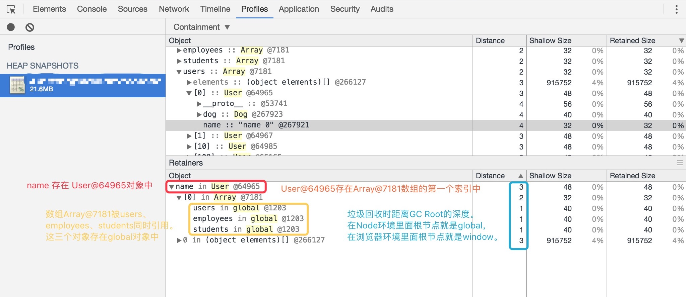
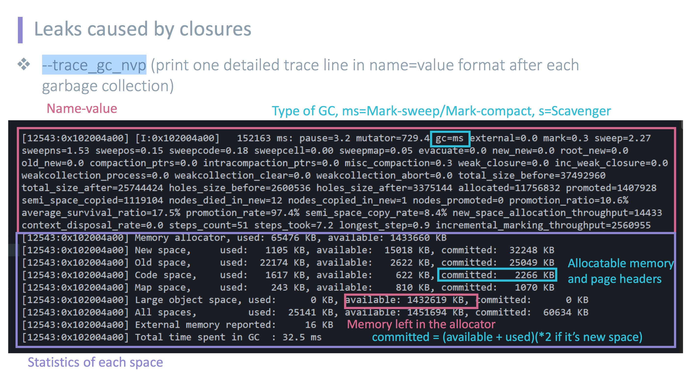

### Node.js 内存分析

### 工具
#### heapdump
heapdump 可以使用来将 v8 引擎的堆内存内容dump出来，这样你就可以在 Chrome 的开发者工具中查看问题。

发送信号 `kill -USR2 <pid>` 后会生成一个内存的快照。导入开发者工具中就能查看了。

#### memwatch
这个可以在代码里直接使用，实时检测内存动态，当发生内存泄漏的时候，会触发 `leak` 事件，会传递当前的堆状态，配合 heapdump 有奇效。

``` JavaScript
const memwatch = require('memwatch');

memwatch.on('leak', function(info) {
    console.error(info);
    let file = '/tmp/myapp-' + process.pid + '-' + Date.now() + '.heapsnapshot';
    heapdump.writeSnapshot(file, function(err){
        if (err) console.error(err);
        else console.error('Wrote snapshot: ' + file);
    });
});
```

#### devTool
安装 `npm install -g devtool`

可以在 devtool 分析 dump 出来的内存信息，也可以使用 devtool 来调试代码。直接 `devtool app.js` 运行代码。


堆快照提供了不同的视角来进行查看：

- Summary 该视图按照构造函数进行分组，用它可以捕获对象和它们使用的内存情况，对于跟踪定位DOM节点的内存泄漏特别有用。
- Comparison 对比两个快照的差别，用它可以对比某个操作前后的内存快照。分析操作前后的内存释放情况以及它的引用计数，便于你确认内存是否存在泄漏以及造成的原因。
- Containment 该视图可以探测堆的具体内容，它提供了一个更适合的视图来查看对象结构，有助于分析对象的引用情况，使用它可以分析闭包和进行更深层次的对象分析。
- Statistics 统计视图。


```javascript
require('heapdump');
const execSync = require('child_process').execSync;

function User(name, age) {
    this.name = name;
    this.age = age;
}

users = [];
for (let i = 0; i < 1024; i++) {
    let user = new User(`name ${i}`, i);
    users.push(user);
}

students = users;
employees = users;

execSync(`kill -USR2 ${process.pid}`);

setTimeout(function() { process.exit(0); }, 3000);
```


更详细的介绍可以查看[Take Heap Snapshot 简介](http://zhuchenglin.me/2016-10-21-chrome-devtools-in-depth-4/#take-heap-snapshot简介)


### GC
在启动时加上 `--trace_gc` 或者 `--trace_gc_nvp` 后每次垃圾回收时都会打印出GC日志。这两日志的格式不太相同。
> node --v8-options | grep gc 


#### GC简介


#### GC日志



```
[11631:0x102001c00]        7 ms: Scavenge 2.1 (6.0) -> 2.1 (7.0) MB, 0.5 / 0.0 ms [allocation failure].
[11631:0x102001c00] Memory allocator,   used:   7204 KB, available: 1459164 KB
[11631:0x102001c00] New space,          used:    957 KB, available:     50 KB, committed:   2048 KB
[11631:0x102001c00] Old space,          used:    888 KB, available:      0 KB, committed:    980 KB
[11631:0x102001c00] Code space,         used:    242 KB, available:      0 KB, committed:   1024 KB
[11631:0x102001c00] Map space,          used:     49 KB, available:      0 KB, committed:     80 KB
[11631:0x102001c00] Large object space, used:      0 KB, available: 1458123 KB, committed:      0 KB
[11631:0x102001c00] All spaces,         used:   2137 KB, available: 1458173 KB, committed:   4132 KB
[11631:0x102001c00] External memory reported:      0 KB
[11631:0x102001c00] Total time spent in GC  : 0.5 ms
```
上面日志的

V8内存结构图

配置参数
node --v8-options | grep space
```
--max-old-space-size
--max-new-space-size
```


### 参考
[【1】](http://taobaofed.org/blog/2016/04/15/how-to-find-memory-leak/) [【2】](https://w3ctech.com/topic/842) [【3】](https://www.w3ctech.com/topic/1711)


http://zhuchenglin.me/chrome-devtools-in-depth-4


http://alinode.aliyun.com/blog/37

http://alinode.aliyun.com/blog/38

https://yq.aliyun.com/articles/25476

http://www.open-open.com/lib/view/open1421734578984.html

http://zhuchenglin.me/chrome-devtools-in-depth-4

http://www.barretlee.com/blog/2015/10/07/debug-nodejs-in-command-line/

https://my.oschina.net/lgmcolin/blog/121434

https://blog.eood.cn/node-js_gc

http://frontenddev.org/link/nodejs-web-service-smooth-upgrade.html

https://blog.eood.cn/node-js_gc

http://sentsin.com/web/138_7.html

http://zhuchenglin.me/performance-optimization-in-action

http://www.itread01.com/articles/1475289787.html

https://segmentfault.com/a/1190000002429825

http://taobaofed.org/blog/2016/04/15/how-to-find-memory-leak/

https://www.w3ctech.com/topic/842

https://w3ctech.com/topic/842

http://taobaofed.org/blog/2016/04/15/how-to-find-memory-leak/

http://deadhorse.me/nodejs/2013/04/13/exception_and_domain.html

https://eggjs.org/zh-cn/core/logger.html

https://eggjs.org/zh-cn/advanced/loader.html

https://eggjs.org/zh-cn/advanced/cluster.html

https://www.w3ctech.com/topic/1711
